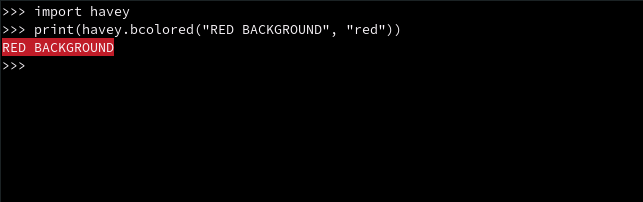

# Introdution

__Module Havey:__ Tool to create menu, colored (background, foreground) text, menu, etc ...

# Installation (Need root privileges)
###### Note: if you have you are in windows skip step 1 & 2. Download havey source code, Extract it, then do step 3, 4.
[Download HAVEY ZIP](https://github.com/Chergui-Nadjib/havey/archive/main.zip)
#### 1. Downloading & Entring Code Dir:
    git clone https://github.com/Chergui-Nadjib/havey.git; cd havey
#### 2 .Adding Executable mode to setup.py:
    chmod +x ./setup.py
#### 3. Running Build:
    ./setup.py build
#### 4. Running Install:
    ./setup.py install

# Usage

> __bcolored:__ Return a colored background text.
>
> 
> 
> __colored:__ Return a colored foreground text.
> 
> 
> 
> __progress:__ Animated Dots.
> 
> 
> 
> __welcome:__ Stars border.
> 
> 

###### Note: This readme file in progress there a undocumented functions. sorry.

# Requirements
> - Python
>
> - Colorama
>
> - Setuptools
> 
> - Git

# License

[Read on GNU.ORG](https://www.gnu.org/licenses/gpl-3.0.txt)
